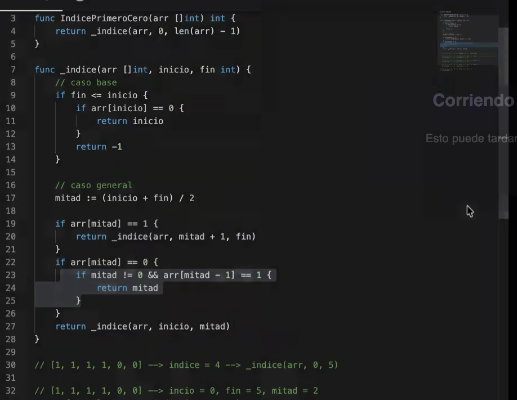

## Consigna
Se tiene un arreglo tal que `[1, 1, 1, ..., 0, 0, ...]` (es decir, unos seguidos de ceros). Se pide:
una función de orden O(logn) que encuentre el índice del primer 0. Si no hay ningún 0 (solo hay unos), debe devolver -1. Demostrar con el Teorema Maestro que la función es, en efecto, O(logn).

## Puntos clave
- Primero "1" y luego "0" -> no puede ser "0" y luego "1"
- Si no hay 0: devolver -1
- Algoritmo log(n) -> algo parecido a la busqueda binaria

## Resolucion

Teniendo en cuenta las condiciones, el elemento que estamos buscando se encuentra luego de un "1", entonces arr[i-1] == 1 y arr[i] == 0. Empiezo por la mitad y luego voy decidiendo si ir por derecha o izquierda, la condición para decidir es: si el anterior es 0 me quedo con la mitad izquierda y sigo buscando el inicio de los "0" en ese lado. Pero si el anterior es "1" voy hacia la derecha. La condicion a chequear en cada iteracion es (caso base):
- Si la longitud de arreglo es 2:
    - Si arr[0] == 0 (el proximo seria 0) -> devolver 0
    - Si arr[1] == 1 y arr[0] == 0 -> devolver 1
    - Si arr[1] == 1 y arr[1] == 1 -> devolver -1


```go
func hallarInicioCero(arr []int, inicio, final int) int {
    // Caso cuando el subarray es 1
    if len(arr) == 1 {
        if arr[0] == 0 {
            return 0
        } else {
            return -1
        }
    }

    // Caso base
    mitad := len(arr) / 2 
    if (arr[mitad] == 0 && arr[mitad - 1] == 1) {
        return mitad
    }     
    else {
        // Buscar en subarrays
        if arr[mitad - 1] == 1 {
            return hallarInicioCero(arr[], mitad, final)
        } else if arr[mitad - 1] == 0 {
            return hallarIniciocero(arr[], 0, mitad - 1)
        }
    }
}
```
La complejidad es O(log(n)) ya que si aplicamos teorema maestro a la ecuacion de recurrencia T(N)=T(N/2) +(O(1)) obtenemos que

 